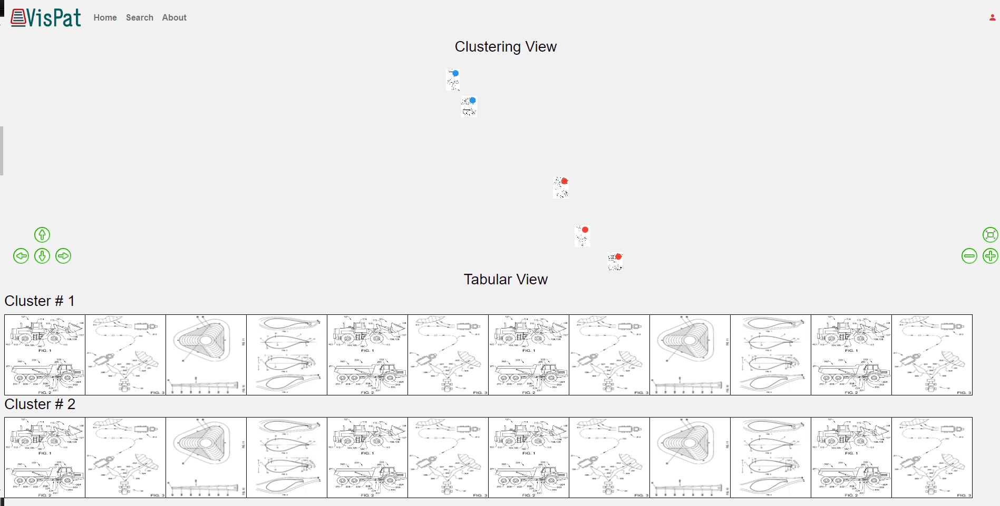

# Clustering-Visualization

## TODOs

- [ ] Get data list from backend rather than hard coded. 
- [ ] Convert images form tif to png to show on frontend. 
- [ ] For thumbnail store resize version of image so loading can be faster for the visualization.
- [ ] Make switch to toggle between graph visualization and tabular view.
- [ ] Fill tabular view from javascript using element append for each cluster and images dynamicaly. 


## Example screen view


## Setup


## Create Conda environment from requirements file provided
```bash
#conda environment via requirements or yml or pip are not always reliable to all OS so that's why doing this way

conda create -n vispat_clustering python=3.8
conda activate vispat_env
conda install -c anaconda flask
conda install -c anaconda flask-login
conda install -c anaconda flask-cors
conda install -c anaconda numpy
conda install -c conda-forge flask-bcrypt

```


## Run development environment
```bash
#for local machine
python ./app/run.py --hostname "0.0.0.0" --port 5011

```


## If you install new library during development
This will update requirements file otherwise you will get error message for missing libraries
```bash
conda list -e > requirements.txt

OR  update the intallation command section

```
